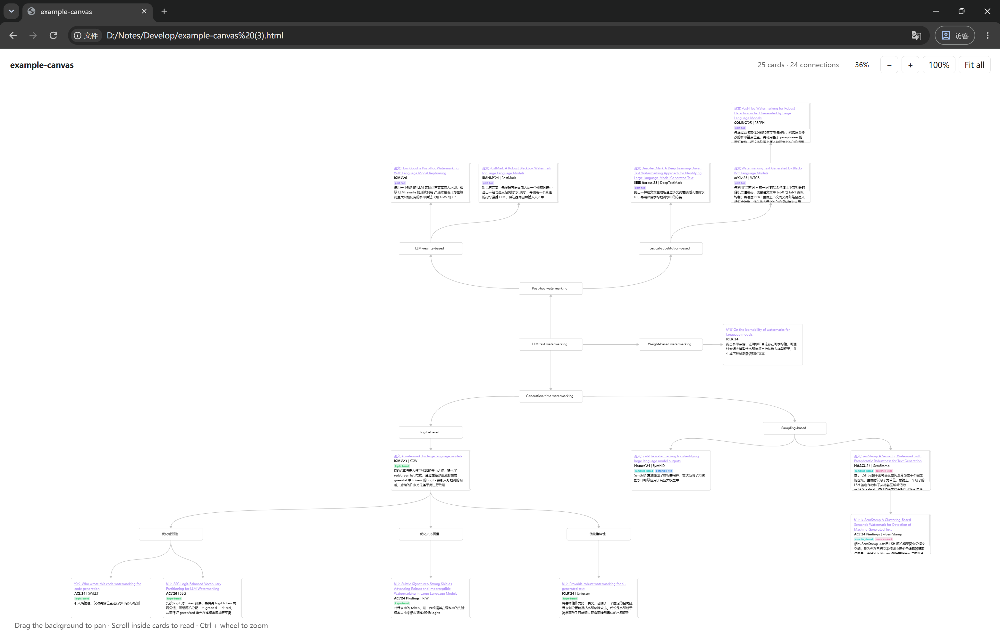
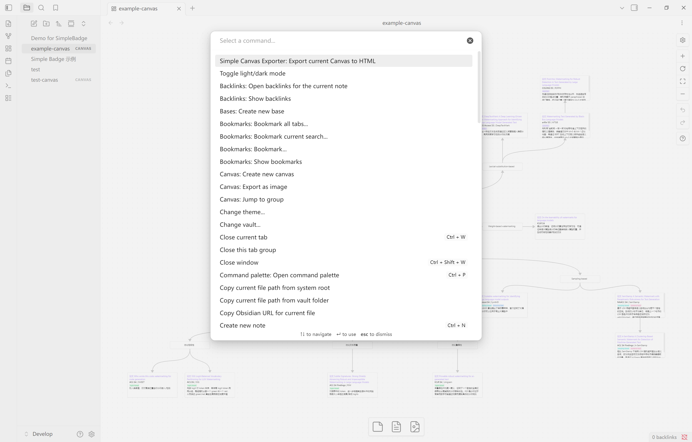

# Simple Canvas Exporter

**English** | [简体中文](README.zh-CN.md)

Export the current Obsidian Canvas to a single HTML file. Cards retain their positions and dimensions, while their contents remain selectable, copyable, and independently scrollable. Open the exported file offline in a browser without installing Obsidian or SimpleBadge.



## Usage

1. Open a Canvas in Obsidian.
2. Press `Ctrl+P` to open the command palette and search for `Simple Canvas Exporter`.
3. Run **Export current Canvas to HTML**. The command is localized when Obsidian is set to Chinese.
4. Choose an output path within your vault, optionally edit the page title, enable author/export time or a background watermark, and click **Export**. By default, the HTML file is saved next to the Canvas. Existing files are preserved: subsequent exports receive numbered names such as `name (2).html`.
5. Click **Open in browser**, or open the generated HTML file directly in your browser.



If Windows asks you to choose an application for HTML files, select a browser such as Edge or Chrome.

The export captures the current view, including changes that have not yet been saved to disk. It includes the entire Canvas, including cards outside the visible area. Each card starts at the top of its content.

The HTML viewer initially fits the entire Canvas into the window. Click **100%** to view cards at their original CSS pixel dimensions. Drag the background to pan, scroll inside a card to read its contents, and use `Ctrl+wheel` to zoom. Cards do not reflow when the browser window changes size or expand to fit their contents.

## Set the title, author, and export time

Version 1.0.0 adds **Page title** to the export dialog. It defaults to the Canvas name and falls back to that name when blank. The title is used in the HTML header, browser tab, and accessible Canvas name; the output filename comes from **Save to**.

**Show author** and **Show export time** are independent, initially disabled options. Enable the author option and enter a name; a blank author is omitted. Selected metadata appears to the right of the title on the same line, in title/author/time order. Long titles and authors use ellipsis with the complete text available on hover. Narrow screens move controls below while keeping this header on one line.

The timestamp captures the local time when export starts, displayed as `YYYY-MM-DD HH:mm`, with seconds and UTC offset on hover. It remains fixed when reopening, sharing, or viewing in another time zone. These options apply to the current export and reset when the dialog is opened again. Printing continues to hide the toolbar.

## Add a background watermark

Version 1.2.0 adds an optional **Background watermark** in the export dialog. Enable it, enter up to 40 Unicode characters, and adjust **Opacity** from 4% to 16% (8% by default) with a live preview. Blank or overlong text requires correction; line breaks and repeated whitespace become single spaces.

Watermarks use 24px system text at a 30° angle, with staggered tiles and extra spacing for long text. Their size stays constant during Canvas pan/zoom, and their ink adapts to the selected background. They sit below groups, connections, and cards: opaque surfaces hide them, while transparent surfaces reveal them. Selection, scrolling, search, badges, and the reader keep their existing behavior.

Each HTML file includes its watermark for offline and no-script viewing. Printing retains it across the complete unscaled scene. There is no watermark editor in the exported viewer; reopening the export dialog starts with watermarks disabled. Existing HTML must be exported again. Watermarks communicate attribution or usage terms; recipients can still edit the HTML or capture cards without the background.

## Search exported HTML

New exports made with 0.2.0 include a search field. All matching text cards receive an outline and matching text is highlighted. Other cards and their connections are dimmed by default; turn off **Dim other cards** to retain their normal appearance. Search includes complete card contents, including scrolled-off text, code, badges, and displayed wikilink aliases.

Queries are literal phrases, not regular expressions; English matching is case-insensitive. Unsupported node placeholders and hidden link destinations are excluded. The status distinguishes matching cards from total occurrences.

- Typing leaves the viewport and card scroll positions unchanged.
- **Previous card / Next card** follows the layout from top to bottom and left to right, and reveals the first occurrence. Use `Enter / Shift+Enter` in the search field for the same navigation.
- **Show all results** fits matching cards into view. **Fit all** still shows the entire Canvas.
- **Clear**, or `Escape` within the search controls, clears the keyword and keeps the current reading position. Selected Badge filters remain active.

`Ctrl/Cmd+F` continues to use browser find. Queries remain in page memory and are cleared on reload; printing removes search decoration. Browsers without CSS Custom Highlight support retain card highlighting, counts, and navigation, with an explanatory message. Older HTML files must be exported again to gain search.

## Read cards in a panel

New exports made with 0.3.0 include a **Read** button at the top right of each nonempty text card. Hover or focus the card to reveal it; touch devices show the button directly. It opens a single panel on the right, or fills the area below the toolbar on narrow screens. Opening another card replaces the panel content.

The panel shows the complete exported text, reflows it to the available width, and scrolls independently of the Canvas. Use **A− / A+** to adjust the reading font from 14 to 22px (16px by default). Heading, badge, and code proportions and theme colors are retained. Font changes apply only to the panel and last until the page is reloaded.

- Search highlights also appear in the panel; counts still include only original cards. Typing or clearing a query does not change the reading card or scroll position.
- **Previous card / Next card** also switches the panel when it is open. **Show all results** changes only the Canvas view. Search navigation does not open a closed panel.
- The source card shows **Reading**, separately from the current search result. Manually reading a card does not change the current search result.
- Close with **×** or `Escape` in the panel. Its own scrolling and font changes leave the original card's scroll position intact. Opening or closing retains Canvas zoom and center; explicit search navigation keeps its usual positioning behavior.
- Reopening starts at the top or first search match. No reading history, view back/forward, or editing is included. Printing excludes the panel and its controls.

Old HTML files must be exported again to gain the reader. It requires no network access or running Obsidian instance.

## Filter by badges

Exports made with 0.4.0 list badges actually present in the Canvas's text cards below search. Click to select or deselect. Each number is the document-wide count of distinct cards containing that badge; repeated spans within one card count once. The catalog is sorted by coverage and remains stable during filtering.

- Multiple selections match **Any** by default; choose **All** to require every selected badge in the same card.
- Use badges alone or combine them with a keyword. Results must satisfy both conditions; plain text with the same label is not a badge match.
- The inline catalog occupies at most two rows. **All N badges** opens a searchable full catalog. Its search field only finds badge names; `Escape` closes the popup.
- **Clear** only clears the keyword. **Reset badges** only clears badge selections and resets the mode to Any. Zero results restore normal Canvas brightness.
- Navigation and **Show all results** use the combined results. Badge-only navigation reveals the matching badge, opening folded details only when explicitly navigating. Changing filters preserves the view and open reading card.
- An excluded reading card stays open with a notice. Reader copies never increase result or badge counts.

**SimpleBadge is optional.** Documents without badges hide the extra controls and retain search and reading. Existing standard `span.badge` markup works even without SimpleBadge installed, using the exporter's built-in fallback styling. Theme colors and normalized custom HEX colors retain separate identities, including same-name badges in different colors. Empty badges, code examples, explicitly hidden content, and placeholders are excluded. Re-export older HTML files to gain these controls.

## Change the Canvas background

Exports made with 0.5.0 add a **Background** button to the toolbar. Choose one of six solid colors, use the native color picker, or enter a 3- or 6-digit HEX color with or without `#`. Colors preview immediately; HEX commits on Enter or blur. Invalid input retains the last valid color. **Restore export color** also removes this document's saved preference.

Only the Canvas background changes. Cards, text, connections, controls, and the reader retain their exported colors; transparent or translucent cards naturally show the new background underneath. Changing colors preserves zoom, position, search, badge filters, and reading scroll. Escape closes the popup; printing uses the original export color.

The viewer tries to remember the color in the current browser, separately for each export and file address. If storage is unavailable, colors still work for the current visit and the popup explains this. Persistence for directly opened local HTML depends on the browser. Preferences do not modify the HTML: moving the file, using another browser, or clearing browser data may lose them, and sharing the file retains its original color. Re-export older HTML to gain this feature.

## Canvas groups

Version 1.1.0 exports group frames and labels at their original Canvas coordinates and dimensions, including border colors, widths, rounded corners, and static background tints. Nested groups remain behind cards and connections. Empty space inside a group can still be dragged to pan the Canvas.

Groups are static: collapse/expand controls and group background images are not exported. Group labels do not participate in text-card search, Badge filtering, or the reader. The toolbar counts groups separately from cards. Re-export older HTML files to include groups.

## Supported features in v1.2.0

| Content | Export behavior |
| --- | --- |
| Text cards | Preserves positions, dimensions, stacking order, borders, colors, and rounded corners |
| Markdown | Uses Obsidian to render paragraphs, headings, bold text, lists, blockquotes, code blocks, tables, and other Markdown content, then captures the static styles |
| Basic HTML | Supports common text formatting, including centered content |
| Wikilinks | Preserves rendered text, aliases, and colors without navigating to source notes; `[[...]]` inside code remains unchanged |
| SimpleBadge | Preserves existing badge text, colors, backgrounds, borders, and font sizes, including all eight built-in colors and custom colors |
| Connections | Prefers the current Canvas's native SVG paths; supports arrow directions, arrows at both ends, connections without arrows, colors, and text labels |
| Local images | Embeds PNG, JPEG, WebP, and GIF images from card contents; limited to 16 MiB per image and a total resource budget of 48 MiB |
| Theme | Captures the light or dark theme and computed content styles at export time |

## Limitations

This release is intended for desktop Obsidian. File cards and web cards retain their positions but display placeholders. Embedded notes, PDFs, remote images, and other unsupported resources are replaced with placeholders and reported in the export notes.

Dynamic plugin components, complex SVG content, and theme decorations that rely on pseudo-elements may not be reproduced completely. Exported files do not execute scripts from notes or run Obsidian plugins.

Native Canvas paths are accessed through an isolated adapter for Obsidian's internal interfaces. If these interfaces are unavailable, the exporter uses compatible curves calibrated against the test Canvas and reports the fallback. Connection labels use a generic label style.

Fonts are not bundled. Opening the file on a computer without the original fonts may change line wrapping. Browser pixel rounding can also cause small differences in thin borders and scroll ranges.

## Privacy and network access

The plugin reads the current Canvas and referenced images from your vault, and saves the HTML within the vault. It does not send exports to a server, collect telemetry, require an account, or access files outside the vault. Opening an export uses your system's default application for HTML files.

During export, Obsidian's Markdown renderer and enabled plugins may request remote resources referenced by cards, such as online images. These requests can occur before unsupported resources are replaced with placeholders. Export-time rendering is therefore not a network sandbox; work offline if your Canvas contains remote content that must not be fetched.

The resulting HTML includes its styles, viewer script, and supported local images. It blocks automatic remote resource loading and can be read offline. External hyperlinks remain clickable and open their destinations only when you follow them.

## Installation

For manual installation, place these three files in your vault's `.obsidian/plugins/simple-canvas-exporter/` directory (replace `.obsidian` if you use a custom configuration folder):

- `main.js`
- `manifest.json`
- `styles.css`

Then enable **Simple Canvas Exporter** in Obsidian's community plugin settings. The plugin ZIP package includes the `simple-canvas-exporter` directory.

Requires desktop Obsidian **1.13.7 or later**. The plugin has been tested on Windows with Obsidian **1.13.7**, SimpleBadge **0.6.0**, and Microsoft Edge. Version 0.4.0 also verifies export with SimpleBadge disabled and documents without badges. Version 0.1.1 fixes missing connection lines with Prism **3.8.0** and Style Settings **1.0.9**, verified against native Obsidian styles and the exported HTML/CSS. Other desktop platforms, later versions, and other third-party themes still require testing. See the [changelog](CHANGELOG.md) for release notes.

## Development

Install Node.js **22.16 or later** and pnpm, then run the following commands from the project directory:

```sh
pnpm install --frozen-lockfile
pnpm check
pnpm test:search
pnpm test:reader
pnpm test:badges
pnpm test:background
pnpm test:metadata
pnpm test:watermark
```

To deploy the built plugin to a development vault:

```sh
pnpm deploy:dev "/path/to/development-vault"
```

`pnpm dev` watches for changes and rebuilds the plugin. Deployment copies only the three runtime files listed above. Disable and re-enable the plugin in your development vault to load an updated build.

`pnpm check` runs the official Obsidian ESLint rules with zero warnings allowed, unit tests, the TypeScript production build, and release metadata checks. `pnpm release` runs these checks and copies the runtime files and license to `release/simple-canvas-exporter/`. The QA module lives in `tests/` and is excluded from production builds.

`pnpm test:search` generates its own offline browser fixtures and uses the installed Edge browser (override with `EDGE_PATH`). It does not require Obsidian to be running. It also checks previously captured default/Prism exports when present in `qa/`. `pnpm test:background` checks color controls, storage and failure handling, keyboard/touch input, printing, and captured content. `pnpm test:metadata` checks the actual export dialog logic and assembler with a minimal Obsidian UI adapter, including retries, optional fields, escaping, frozen timestamps, and responsive headers; it does not replace live Obsidian testing. The standalone viewer uses standard browser DOM APIs: its ESLint configuration permits the native DOM helpers and `localStorage` needed outside Obsidian, while preserving the plugin's other restrictions.

Pass the development vault path explicitly; the project does not configure a default vault. You can also invoke `node scripts/deploy.mjs "/path/to/development-vault"` directly.

The repository keeps plugin code in `src/`, test cases and fixtures in `tests/`, development scripts in `scripts/`, supporting documentation in `docs/`, and README images in `assets/`. Installed dependencies, the package cache, generated `main.js`, QA output in `qa/`, and release packages in `release/` are excluded from Git. QA output can be regenerated using the steps in [the testing guide](docs/TESTING.md).

The source modules are organized as follows:

| Module | Responsibility |
| --- | --- |
| `canvas.ts` | Data validation and geometry calculations |
| `runtime.ts` | Current-view snapshots and native Canvas path adaptation |
| `render.ts` | Card content rendering |
| `styles.ts` | Style snapshots and conversion to static content |
| `assets.ts` | Image embedding |
| `export.ts` | HTML assembly and file saving |
| `viewer-html.ts` | Exported viewer toolbar and localized search controls |
| `viewer.ts` | Browser navigation, zooming, scrolling, and text search |

See [TESTING.md](docs/TESTING.md) for validation results and reproduction steps, and [DESIGN.zh-CN.md](docs/DESIGN.zh-CN.md) for the original design. Both documents are currently in Chinese. See [the release guide](docs/RELEASING.md) for GitHub and community submission steps.

## License

This project is licensed under the [MIT License](LICENSE).
