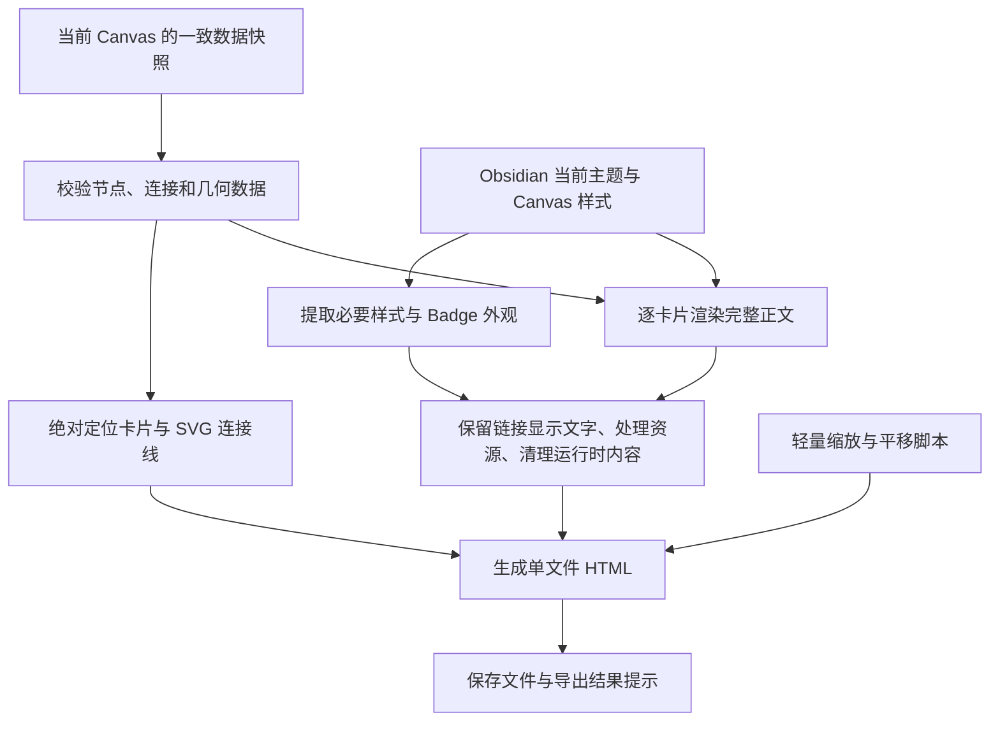

**Simple Canvas Exporter：设计与实施计划**

日期：2026-09-12。状态：v0.1.0 已实现并完成开发 vault 与浏览器验收；实际支持范围见 [README.md](../README.md)，验证记录见 [TESTING.md](TESTING.md)。以下保留原始设计依据；当前版本同名文件始终自动编号，未提供覆盖选项。

建议采用“Canvas 数据确定布局、Obsidian 渲染正文、HTML 与 SVG 承载导出结果”的方案。输出是一份可以独立阅读的 HTML；每张卡片保留原始尺寸，正文可以选择、复制和滚动。

以下默认值是本次设计建议，可在实现前调整：单文件离线导出、固定导出时的主题、初始适应全图、提供 100% 视图、卡片正文从顶部开始显示、首版面向桌面 Obsidian 和桌面浏览器。

**已核实的项目情况。** 插件目录 `D:\Code\OB-SimpleCanvasExporter` 在本次检查时为空，没有需要兼容的现有代码。开发 vault 为 `D:\Notes\Develop`，主验收文件的副本保存在 [example.canvas](../tests/fixtures/example.canvas)。

| 样例项目 | 实际情况 | 对实现的影响 |
| --- | --- | --- |
| 节点 | 25 个，全部为文字卡片 | 第一轮能够集中验证文字卡片导出 |
| 连接线 | 24 条 | 必须逐条保留连接关系、连接边和箭头方向 |
| 卡片尺寸 | 11 张 320×60；13 张 400×200；1 张 400×205 | 不能使用统一卡片高度或按正文撑高 |
| 节点边界 | x 为 -2560～1740；y 为 -3500～-920 | 支持负坐标；节点整体跨度为 4300×2580 |
| 双链 | 14 张卡片含有 `[[]]` | 保留显示文字；不需要源笔记也能阅读 |
| Badge | 13 张卡片含有 Badge | 导出必须携带 Badge 样式及其主题色 |
| 居中 HTML | 11 张卡片使用 `
` | 必须保留正文中的基本 HTML 排版 |

当前 vault 的第三方插件启用列表只有 Simple Badge；安装版本是 0.5.0。实际源码目录为 `D:\Code\OB-SimpleBadge`。源码与 vault 中的 `styles.css` 哈希一致。`appearance.json` 为空，不能据此确定运行中的明暗模式、字号或实际计算样式，需要在后续原型阶段读取。

SimpleBadge 的 [序列化代码](D:/Code/OB-SimpleBadge/src/model.ts:134) 将 Badge 写成 `span`，[显示样式](D:/Code/OB-SimpleBadge/styles.css:1) 提供颜色、背景、边框和字号。当前显示方式不依赖该插件的 Markdown 后处理器。导出已有 Badge 无需读取其预设数据库，也无需在浏览器运行 SimpleBadge。

**导出后的阅读方式。** 在 Obsidian 中打开 Canvas，执行“将当前 Canvas 导出为 HTML”。导出完成后得到例如 `example-canvas.html` 的文件，可以复制到其他目录或发送给他人，通过浏览器直接打开。

| 操作或设置 | 首版建议 |
| --- | --- |
| 导出范围 | 整张 Canvas，包括当前屏幕之外的卡片和连接线 |
| 入口 | 命令面板中的导出命令；非 Canvas 视图时禁用 |
| 默认位置 | Canvas 所在目录，可在导出窗口修改 vault 内的相对路径 |
| 同名文件 | 默认生成编号副本；主动选择覆盖时才替换已有 HTML |
| HTML 外观 | 固定为导出时的主题，不随阅读设备的明暗模式变化 |
| 初始视图 | 适应全图；工具栏提供缩小、放大、100%、适应全图 |
| 移动画布 | 拖动空白区域；在空白区域滚轮或触控板平移 |
| 查看长卡片 | 普通滚轮优先滚动鼠标所在卡片；到边界不突然带动画布 |
| 查看细节 | 缩放按钮；可增加 Ctrl+滚轮作为快捷操作 |
| 选择与复制 | 卡片内正常选择文字，拖选不触发画布平移 |

“保留原始大小”定义为：在 100% 视图下，卡片外框的 CSS 像素宽高与 Canvas 数据相同。适应全图只缩放整个场景，不改变单张卡片的排版宽度。不同屏幕尺寸不会触发卡片重排。卡片内部的初始滚动位置统一为顶部，首版不保存 Obsidian 当前的临时滚动位置。

**整体实现路线。** 数据和显示分开处理：数据负责完整性，Obsidian 负责正文渲染和样式参考，浏览器负责最终阅读。只复制当前可见的 Canvas DOM，可能缺少未渲染的屏幕外节点或正文，因此不能作为整张 Canvas 的唯一导出来源。

第一轮视觉原型需要解决三个决定性问题：当前 Canvas 视图能否稳定取得最新数据；箭头路径如何与实际画面匹配；按相同内容宽度渲染时，换行、字号及溢出能否与原卡片匹配。原型通过后再完善插件界面与配置。

**布局和连接线。** 卡片使用绝对定位的 HTML 元素，连接线使用独立 SVG。两者放入同一个场景容器，共享坐标变换，因此缩放和平移时不会彼此错位。

卡片保留 `x/y/width/height`。允许整体平移到正坐标，例如 `left = x - minX + padding`，但不能分别调整节点间距。节点覆盖顺序保留源数据中的顺序。JSON Canvas 定义了节点几何信息及连接端点，但没有给出 Obsidian 的具体贝塞尔控制点或主题的实际颜色；这些需要从应用画面校准。[JSON Canvas 官方规范](https://jsoncanvas.org/spec/1.0/)

连接线处理需要同时保留起点、终点、各自连接哪一边、端点箭头、颜色和标签。样例没有显式写出端点形状，应按规范应用默认箭头，而不是因为没有 `toEnd` 就省略箭头。缺少连接边时使用确定性的自动选边规则；这类情况加入补充测试，不能假定样例已覆盖。

原型阶段优先验证是否能按连接 ID 取得应用实际 SVG 路径。如果能够完整、稳定地取得，就复用路径以及必要的箭头定义，并消除当前视口缩放和平移的影响。不能直接复制屏幕像素坐标。

同时准备独立的路径计算模块：按节点边界锚点和方向向量生成曲线，以样例的直连、转弯、多分支和反向连接校准。运行时路径读取属于版本适配能力，不假定它是稳定公开 API。无法取得实际路径时使用校准后的算法，并在导出结果中说明发生了近似；样例中明显偏离的曲线仍视为未通过验收。

完整性以源数据 ID 为准，逐一核对 25 个节点和 24 条连接。不能只检查“页面里有一些卡片和线”。最终场景边界还要包括曲线外伸、箭头、边框阴影和连接标签，不能仅以节点边界裁切 SVG。SVG 自身设置不拦截卡片鼠标事件。

**正文渲染和双链。** 使用公开的 `MarkdownRenderer.render(app, markdown, element, sourcePath, component)` 在 Obsidian 内渲染完整 Markdown，然后序列化静态结果。该接口提供来源路径和组件生命周期参数，适合处理相对引用及渲染后的资源清理。[Obsidian 官方 API 定义](https://github.com/obsidianmd/obsidian-api/blob/master/obsidian.d.ts)

渲染容器必须连接到 DOM，使用与卡片相同的正文宽度和相关 Canvas 样式上下文。不要用 `display: none` 的容器采集尺寸；可以使用屏幕外、不可交互的临时容器。测量时使用未缩放的 CSS 尺寸，避免将当前画布缩放误认为字号或卡片宽度。

普通文字、粗体、段落、换行、列表、引用、代码块、表格和基本 HTML 走同一渲染流程。样例里的 Markdown 硬换行和 `
` 尤其需要验证。小标题卡片是否还有额外的容器对齐，应以实际 Canvas 为准，不能把所有文字强制垂直居中。

双链在渲染后处理，保留 Obsidian 实际产生的显示内容：`[[笔记]]` 保留笔记名，`[[笔记|别名]]` 保留别名，标题或块引用保留其渲染后的文字。把内部链接转换为无跳转行为的文本容器，同时保留正常状态的文字颜色等视觉特征；移除跳转目标、悬浮预览属性和误导性的手型光标。

不对 Markdown 全文使用正则表达式剥除双链，否则容易破坏别名、转义、嵌入和代码块。未解析的双链也要保留显示文字；不需要目标笔记存在，更不需要把目标笔记自动导出。普通 HTTP/HTTPS 链接可以继续作为外部链接使用。

渲染完成不能只依靠固定延时。先等待渲染 Promise，再等待本次相关的字体和图片加载，并设置有上限的稳定等待；对有异步内容的节点记录超时或降级。Obsidian 后处理器可以继续修改渲染结果，因此仅等待初次 Markdown 转换不代表所有插件都已完成。[Obsidian 官方后处理文档](https://github.com/obsidianmd/obsidian-developer-docs/blob/main/en/Plugins/Editor/Markdown%20post%20processing.md)

每次导出使用独立 Component，在成功、失败和取消后统一卸载组件并移除临时 DOM。不会把 Obsidian 的事件处理器或插件运行时代码带入浏览器。

**主题与 SimpleBadge。** 采用导出器自己的基础结构 CSS，加上从实际 Canvas 环境提取的必要样式值。重点包括字体、字号、行高、正文内边距、段落间距、卡片背景、边框、圆角、阴影、正文颜色、链接文字颜色和连接线样式。

主题色需要在导出时解析为可独立使用的颜色。仅保留 `var(--color-cyan)` 等变量引用是不够的，HTML 中必须同时定义变量或写入解析后的实际颜色。

SimpleBadge 单独提供一个小型适配器：识别 `.badge`、八种主题色类和 `.badge-custom`，保留文字与自定义 `--simple-badge-color`。当前基础样式为行内块、相对字号、固定圆角和边框；它与正文行高一起决定 Badge 是否挤占下一行，不能只复制颜色。

适配器输出 Badge 实际需要的 CSS。优先冻结实际渲染的前景色、背景色、边框、字号和间距，保留主题或 CSS snippet 对它的修改；对背景混色结果尽量保存可直接显示的颜色，减少浏览器重新计算造成的差异。未安装或未启用 SimpleBadge 时，内置兼容规则仍能提供基础显示，并在结果中标注使用了默认外观。

不会直接带走整套 Obsidian 界面 CSS 或 SimpleBadge 的设置窗口样式。计算样式也不应全部机械内联：外层宽高由 Canvas 几何数据控制，正文内容需要维持自然高度，不能把临时渲染容器的裁切高度、视口变换或滚动偏移固化进去。伪元素、复杂主题选择器等需要额外适配，不能假设普通计算样式自动覆盖。

首版固定一种导出时的主题，不提供浏览器内明暗切换。自定义字体默认保留字体栈，不自动打包字体文件；同机同字体作为文字换行的基准验收环境。跨设备缺少字体时可能产生换行差异，这不应被表述为任意设备逐像素一致。

**卡片尺寸和滚动。** 卡片外壳按 `border-box` 固定宽高，边框与圆角属于这个外框。外壳负责裁切圆角；内部正文容器获得明确的可用宽高，并设置 `overflow: auto`。如果使用 flex/grid，显式设置需要收缩的容器 `min-height: 0` 和 `min-width: 0`。

正文完整保存在 HTML 中，只由滚动视口决定当前可见范围。不能截断字符串、固定只导出首屏内容，或把溢出正文永久隐藏。实现时先复用原卡片的滚动层和内边距关系，确认不会多出一层 padding 或多层纵向滚动条。

一般文字按原卡片的换行规则显示；过宽代码块和表格在必要时允许局部横向滚动，不撑宽卡片。普通滚轮在卡片内由浏览器原生处理，外层画布手势逻辑必须跳过这些事件，并阻止滚动链意外传给整个场景。采用原生滚动条和必要的轻量配色，其细节可能随浏览器和操作系统变化。

SVG 连接点始终连接卡片外框，不随正文滚动改变。缩放的是整个场景，卡片的 `scrollHeight` 和正文排版基准不随缩放重算。

**独立 HTML 和内容范围。** 文件内嵌 CSS 和少量阅读交互脚本，不使用 CDN、远程模块、运行时 `fetch()` 或 Obsidian 专用协议加载基础内容。脚本负责视口操作，正文和连线本身已在 HTML 中。脚本禁用时应保留可以通过页面滚动查看的静态场景。

| 内容 | 首版范围 | 后续扩展 |
| --- | --- | --- |
| 文字卡片、原始布局、连接箭头 | 完整实现，以样例验收 | 更复杂的曲线和主题适配 |
| 基础 Markdown、双链显示文字、基本 HTML | 支持 | 更复杂的 HTML/CSS |
| SimpleBadge 主题色与自定义色 | 明确支持并单独验收 | 随 SimpleBadge 格式演进适配 |
| 文字卡片中的本地 PNG/JPEG/WebP 图片 | 转为内嵌资源；补充测试 | SVG、更多媒体类型 |
| group、文件型卡片、链接型卡片 | 保留几何位置和明确的占位说明 | 分组样式、Markdown 文件正文、图片文件卡片等 |
| Mermaid、公式、其他插件动态视图 | 已能形成静态结果的可尝试导出，但不列入首版保证 | 逐项添加适配器和验收 |
| 在线网页、视频、PDF、交互查询 | 不承诺离线还原，显示可理解的占位信息 | 按实际使用需求扩展 |

这份样例只有文字卡片，不能用于证明其他 Canvas 节点类型已兼容。占位不是视觉还原成功：遇到这些内容时，结果应标为部分支持，并列出对应节点，避免静默遗漏。

离线资源处理针对本次导出的直接内容；不会递归收集整个 vault。内部双链只导出显示文字，嵌入语法 `![[...]]` 与双链分别处理。解析本地图片时使用来源路径与 vault 资源解析，不能把 Obsidian 的 `app://`、临时 Blob URL 或本机绝对路径原样输出。重复资源缓存转换结果，设置合理的总大小上限并提供明确提示。

远程图片和网页默认不自动下载，首版以占位说明保持单文件离线含义。图片未找到或渲染失败时，保留卡片及其尺寸并显示替代文字。HTML 只保留静态内容需要的标签、属性、SVG 和样式；移除笔记里的脚本、事件属性和运行时嵌入组件，同时保留 Badge 需要的 class 与颜色变量。导出脚本和用户内容分开序列化，处理 HTML 特殊字符和结束标签，避免正文破坏整个文件结构。

**数据一致性与错误处理。** 点击导出时确定目标文件并取得一次不可变快照，后续所有节点和连接都基于该快照。对于仍在编辑中的 Canvas，原型应验证是否可通过 `TextFileView` 的公开方法取得最新序列化数据；仅在实际视图满足相应能力时使用，不假定存在公开的 `CanvasView` 类型。

无法可靠取得正在编辑的最新内容时，不能静默回退成旧磁盘内容并声称“导出当前状态”。应说明只能导出已保存版本，或结束本次导出并提示保存后重试。第一轮加入“刚改完一张卡片立即导出”的验证。

解析失败、重复节点 ID、非法尺寸等阻止生成看似成功的文件。无效连接引用应保留诊断，不影响其他有效卡片的渲染；单个节点失败使用固定尺寸占位并报告。空 Canvas 输出可理解的空场景，不计算无穷边界。用户取消、磁盘写入失败、重复点击导出都需要正常收尾。

结果区分完整成功、带降级完成和失败。成功提示包含文件位置；有问题时才附带缺失资源、近似路径或未支持节点的数量与简短原因。建议先在内存中完成 HTML，再写入新文件；替换已有文件时保留失败恢复路径。

**建议的代码组织。** 使用 TypeScript、Obsidian API 和 esbuild，插件界面使用 Obsidian 原生组件。阅读页使用原生 DOM/CSS/SVG 与少量 TypeScript 编译后的脚本。项目规模不需要前端框架或图布局引擎。

| 文件或模块 | 责任 |
| --- | --- |
| `src/main.ts` | 插件生命周期、导出命令 |
| `src/ui/export-modal.ts` | 文件名、保存目录、导出进度和结果 |
| `src/export/pipeline.ts` | 组织一次导出、取消、清理和结果报告 |
| `src/canvas/schema.ts` | Canvas 类型、校验和规范默认值 |
| `src/canvas/snapshot.ts` | 取得一致数据快照，隔离视图版本适配 |
| `src/canvas/geometry.ts` | 几何边界、坐标平移、端点和曲线计算 |
| `src/canvas/runtime-adapter.ts` | 可选实际路径与样式采样；包含能力探测 |
| `src/render/markdown.ts` | 正文渲染、来源路径、异步完成和组件清理 |
| `src/render/styles.ts` | Canvas 及正文样式采样、冻结和必要规则 |
| `src/render/simple-badge.ts` | SimpleBadge 外观适配 |
| `src/export/content.ts` | 双链转换、静态内容清理和序列化 |
| `src/export/assets.ts` | 本地资源解析、内嵌、缓存和限额 |
| `src/export/html.ts` | 组装独立 HTML、SVG、样式和交互脚本 |
| `src/viewer/` | 导出页的缩放、平移和滚动事件处理 |
| `scripts/deploy.mjs` | 复制构建产物到开发 vault 的插件目录 |
| `tests/` | 几何、导出完整性和浏览器行为验证 |

上述是责任划分，不要求第一天创建所有文件。纯数据与几何模块不导入 Obsidian，方便直接测试。涉及内部 Canvas 视图或 DOM 的代码集中在适配层，能力缺失时产生明确降级。

最低 Obsidian 版本根据实际调用的 API 和原型验证后确定，不直接照搬 SimpleBadge 的兼容声明。开发依赖安装后锁定版本；发布时区分“声明最低版本”和“已实测版本”。

**实施顺序和阶段产物。** 第一阶段验证能否达到视觉要求，然后完成导出链路，最后补齐使用体验。不会先投入复杂设置页再发现渲染方案无法保留正文或箭头。

| 阶段 | 具体工作 | 产物与通过条件 |
| --- | --- | --- |
| 1：视觉原型 | 读取实际 Canvas 样式；选居中标题、带 Badge、长正文、400×205 卡片；验证最新数据与代表性连接路径 | 原型 HTML 和同尺度对照图；确认固定尺寸、换行、完整正文、滚动和箭头路线 |
| 2：完整导出 | 建立插件工程；接入快照、校验、正文渲染、样式冻结、Badge、双链和 SVG | 样例全量导出，25 张卡片与 24 条连接逐一匹配 |
| 3：阅读与保存 | 单文件打包、常见本地图片、缩放平移、手势冲突处理、导出窗口和结果报告 | HTML 可独立离线打开；能读完长卡片，100% 视图可用于核对尺寸 |
| 4：开发 vault 验收 | 构建并部署至 `.obsidian/plugins/simple-canvas-exporter`；实际执行导出；浏览器对照并修复偏差 | 验收记录、必要截图、示例 HTML、安装使用说明和可安装构建产物 |

第一阶段发现的视觉差异应在后续阶段前解决或明确记录；不能把严重差异仅作为最后文档中的已知问题。后续版本再增加文件右键入口、分组与文件卡片等已经明确的扩展点。

**验收标准。** 当前还没有运行下面的测试；它们是实施完成的判断条件。

| 项目 | 验收方式 |
| --- | --- |
| 独立打开 | 将 HTML 复制到 vault 外，在断网条件下用桌面 Edge/Chrome 打开；正文、Badge 和箭头不依赖 Obsidian 或本地服务 |
| 完整性 | 样例的 25 个节点和 24 条连接都存在，ID 逐一对应；屏幕外内容不遗漏 |
| 几何尺寸 | 100% 视图下节点位置经过统一平移后对应源数据，外框宽高偏差控制在 1 CSS px 内；包含 400×205 卡片 |
| 连接关系 | 每条边连接正确卡片的正确边，默认箭头不丢失；曲线、箭头大小和遮挡关系与原图对照 |
| 样式与换行 | 同机、同字体、同主题、同尺度对比居中标题、普通卡片和 Badge；选择多条长英文标题及中英文混排检查换行 |
| 长正文 | 优先检查 WTGB、RSFPH、SemStamp 等长内容卡片；在实际确认溢出的卡片中，外框不变且能滚动到最后一行 |
| 双链 | 14 张含双链卡片的显示文字保留；补充别名、未解析链接、标题引用和代码中的字面双链测试 |
| Badge | 13 张 Badge 卡片外观逐一核对；补充八种主题色和自定义 HEX，不依赖预设数据库 |
| 交互 | 卡片内滚轮不移动外层场景；滚动到底也不跳动；拖选文字不平移；缩放后箭头仍对齐 |
| 独立资源 | 本地图片内嵌后可读；缺失或未支持资源明确占位；无残留 Obsidian 资源 URL |
| 最新状态 | 修改卡片正文或位置后立即导出，结果含最新修改，或明确阻止无法保证一致性的导出 |
| 失败路径 | 无效 JSON、无效连接、空 Canvas、单卡失败、取消和写入失败均能正确收尾 |

自动化重点放在坐标变换、连线端点与默认箭头、几何边界、双链转换、资源序列化和导出节点完整性。滚动与手势应在真实浏览器运行时验证；文字换行、曲线形状及主题外观需要实际画面对比。运行类型检查、构建和与改动相关的测试，不用快照字符串一致代替视觉验收。

测试使用原样例作为基准，补充案例放在独立测试文件中。当前样例 SHA-256 为 `0C50775982E848866C79C1B30CBB4C8EAE5EE5C9CC98CB225CA62BEA78DD0D1E`，可用于确认原始基准未被测试过程改变。

第一版完成的含义是：你的样例能够生成独立 HTML，保持卡片布局和尺寸，显示原有文字、双链文字与 Badge，连接线经对照校准，并且所有溢出正文都能在原尺寸卡片内通过滚动查看。跨主题、跨字体及其他节点和插件类型的兼容性，按明确的补充案例逐步扩展。
